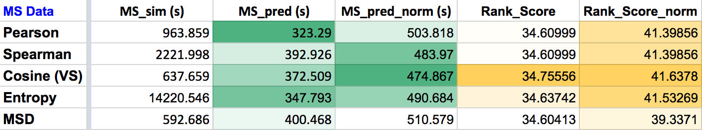

# Spring 2018


# Project 3: Algorithm Implementation and Evaluation

----


### [Project Description](doc/)

Term: Spring 2018

+ Project title: Collaborative Filtering on [`Anonymous Microsoft Web`](https://archive.ics.uci.edu/ml/datasets/Anonymous+Microsoft+Web+Data) and [`EachMovie`](http://www.gatsby.ucl.ac.uk/~chuwei/data/EachMovie/eachmovie.html) Data
+ Team Number: 5
+ Team Members: Jessica Zhang, Jiongjiong Li, Xiangyu Liu, Ginny Gao, Daniel Parker
+ Project summary: We used 2 types of collaborative filtering algorithms: Memory-based and Model-based on 2 data sets, `Ananoymous Microsoft Web` for implicit rating (website visited or not, 1 or 0), and `EachMovie` for explicit rating (voting value between 0 and 5), to predict users' ratings on webpages or movies they have't rated, which indicates they might not know thesed items, and based on the ratings, these items could be good recommendations for them. Details can be found in [`main.R`](https://github.com/GU4243-ADS/project-3-algorithms-project-3-algorithms-group-7/blob/master/doc/main.R).

## Memory-based Algorithm:

We computed different similarity weights including Pearson's and Spearman's correlation, vector similarity "cosine" measure, entropy-based uncertainty measure, mean-square difference (MSD), and SimRank. Next, we predicted ratings on training data and compared with test. Then, we applied rating normalization and compared with results before to examine if this change enhances model performance. For Microsft data, model performance from using different similarity weights is very close, with vector similarity (cosine similarity) slightly tops the rank score. Pearson takes least amount of time to run prediction, its rank score is the same as Spearman. After using rating normalization, model performance showed improvements for all similarity weights. Vector similarity tops the rank score again and uses least amount of time. Entropy comes next in rank score, but it uses significantly longer time to compute similarity weight, more than 20 times than MSD. MSD takes least amount of time to calculate similarity though its rank score is lowest before and after normalization.




## Model-based Algorithm - clustering:

In the model-based algorithm, we applied the clustering model on the Microsoft data using EM algorithm. For the cross-validation, we separated the trianing data into two datasets, including a new training dataset and a new validation dataset. We then used these two new datasets to calculate the rank scores for four different numbers of classes (2, 6, 8, 10). We expected to find 4 accurancy levels for each of the four classes, in order to find the best number of classes to use. With this number, we could evaluate our model. However, becasue of lack of time and the numerous size of our dataset, we were unable to successfully run the cross-validaiton. Instead, we decided to use 6 as our numbder of classes, from which we got a best rank score of 32.3.

## Contribution statement:  

- Jessica Zhang: Model-based Algorithm, first-draft of model-based algorithm and code sum up, cross-validation.

- Jiongjiong Li: Model-based Algorithm, wrote the MAE, ROC, ranking score function, code sum up.

- Xiangyu Liu: Memory-based Algorithm, explored Mean Square Difference weights, simrank weigths, normalization on different data sets. Predicted the final ratings of each. Also tested Mean Square Difference weights with normalization and compared the performance. base + evaluation. 

- Ginny Gao: explored different similiary weighting measures (Pearson, Spearman, Vector Similarity, Entropy, Mean Square Difference) in Memory-based model, and experimented on whether rating normalization (according to Paper 2, Sec 7) enhances model performance. Tested different similarity weights with normalization, compared different evaluatation metrics.

- Daniel Parker: 


Following [suggestions](http://nicercode.github.io/blog/2013-04-05-projects/) by [RICH FITZJOHN](http://nicercode.github.io/about/#Team) (@richfitz). This folder is orgarnized as follows.

```
proj/
├── lib/
├── data/
├── doc/
├── figs/
└── output/
```

Please see each subfolder for a README file.
